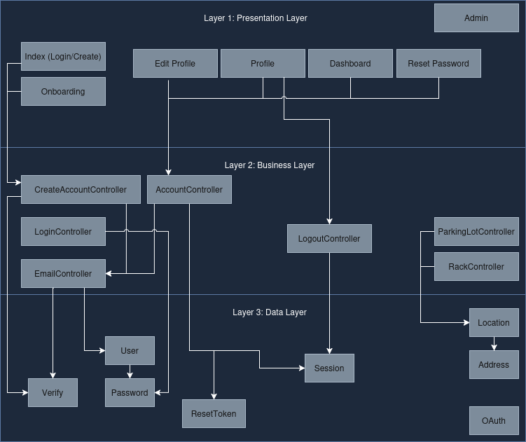

# Open Spot

- [MVC Diagram](#mvc-diagram)
- [Layered Architecture Interaction Overview](#layered-architecture-interaction-overview)
    - [Presentation Layer -> Business Layer](#presentation-layer---business-layer)
    - [Business Layer -> Data Layer](#presentation-layer---business-layer)
    - [Data Layer (Foundational)](#data-layer-foundational)
- [Getting Started](#getting-started)


### Project Overview

Open Spot aims to streamline the process of finding open parking and bike spots for Illinois State University students. Users can create accounts, log in, manage profiles, and save favorite spots for quick access. The project is in its early stages, and we welcome contributions to help build a robust and user-friendly application.

## MVC Diagram



The diagram above shows the Model-View-Controller architecture for our project.

## Layered Architecture Interaction Overview

This architecture consists of three layers:

1. **Presentation Layer** – UI and user interaction
2. **Business Layer** – Core logic and orchestration
3. **Data Layer** – Persistent storage and data access

---


### Presentation Layer -> Business Layer

#### How It Talks
- UI components (e.g., Login, Dashboard, Edit Profile) trigger controllers in the Business Layer.
- Communication happens via user actions like form submissions, button clicks, or page loads.

#### Why It Depends
- Presentation Layer does **not handle logic** like authentication or session management.
- It relies on Business Layer for:
  - Authenticating users (`LoginController`)
  - Creating accounts (`CreateAccountController`)
  - Managing sessions (`LogoutController`)
  - Fetching data (`ParkingLotController`, `RackController`)

#### Components:
- Index (Login/Create) Page -> Start
- Onboarding Page
- Edit Profile Page
- Profile Page
- Dashboard Page
- Reset Password Page
- Admin Page

#### Dependencies:
- `Index` → `Onboarding`, `Reset Password`
  - After login/create, users may be routed to onboarding or password recovery.
- `Onboarding` → `Dashboard`, `Index`
  - Onboarding prompts futher profile setup before granting dashboard access, if user is verified.
- `Edit Profile` → `Profile`
  - Profile view reflects changes made in Edit Profile.
- `Dashboard` → `Profile`, `Admin`
  - Dashboard may link to profile summary or admin tools.
- `Reset Password` → `Index`
  - After reset, users return to login.


---


### Business Layer -> Data Layer

#### How It Talks
- Controllers invoke data access objects or services to query/update persistent data.
- Example: `LoginController` might call `Verify`, `Password`, and `Session`.

#### Why It Depends
- Business Layer needs the Data Layer to:
  - Validate credentials (`Verify`, `Password`)
  - Store/retrieve user data (`User`, `Session`, `Location`)
  - Handle password resets (`ResetToken`)
  - Manage OAuth flows (`OAuth`)
  - Resolve addresses (`Address`)


#### Controllers:
- CreateAccountController
- LoginController
- EmailController
- AccountController
- LogoutController
- ParkingLotController
- RackController

#### Dependencies:
- `CreateAccountController` → `EmailController`, `AccountController`
  - Sends verification email and creates user record.
- `LoginController` → `AccountController`, `LogoutController`
  - Validates credentials and manages session lifecycle.
- `EmailController` → `AccountController`
  - Email actions (verify, reset) require user lookup.
- `AccountController` → `ParkingLotController`, `RackController`
  - Account context may determine access to parking/rack data.
- `LogoutController` → `Session` (via AccountController)
  - Ends active session tied to account.
- `ParkingLotController` → `RackController`
  - Parking lots may contain racks; rack data is nested.

---


### Data Layer (Foundational)

#### How It Talks
- It **does not initiate communication**.
- It only responds to requests from the Business Layer.

#### Why It’s Independent
- It’s the **source of truth** for all persistent data.
- Designed to be reusable and agnostic of business logic or UI concerns.

---
#### Entities:
- Verify
- User
- Password
- ResetToken
- Session
- Location
- Address
- OAuth

#### Dependencies:
- `Verify` → `User`, `Password`
  - Verifies identity using stored credentials.
- `Password` → `ResetToken`
  - Password reset requires valid token.
- `Session` → `User`
  - Sessions are tied to user records.
- `Location` → `Address`
  - Location data includes address resolution.
- `OAuth` → `User`, `Session`
  - OAuth flows create sessions and link to users.


## Getting Started

### Connecting to github:

In a terminal, generate a new SSH key pair using:

```bash
ssh-keygen -t ed25519 -C "your_email@example.com"
```

Then, press Enter to save the key in the default location.
Optionally, enter a strong passphrase when prompted for added security.

### Copy the Public SSH Key:

- Navigate to the directory where your SSH key was saved (e.g., ~/.ssh/).
- Open the public key file (e.g., id_ed25519.pub or id_rsa.pub) with a text editor.
- Copy the entire content of the file, including ssh-ed25519

### Add the Public Key to GitLab:

- Log in to your GitLab account.
- Click on your avatar in the upper-right corner and select "Edit profile" or "Settings".
- In the left sidebar, select "SSH Keys".
- Click "Add new key".
- Paste the copied public key into the "Key" field.
- Provide a descriptive "Title" for the key (e.g., "Open Spot").
- Click "Add key".

### Set Up the Environment:

- Install Git: https://github.com/git-guides/install-git
- Install Node.js: https://nodejs.org/en/download
- Install Visual Studio Code: https://code.visualstudio.com/download

### Clone the Repository:

```bash
git clone https://github.com/nghilbert/open-spot
```
